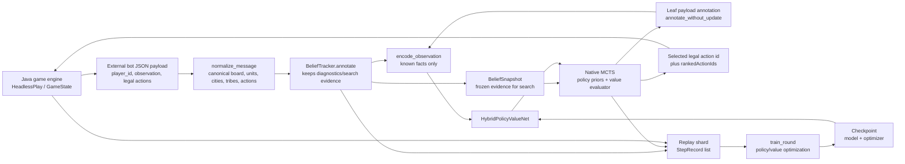
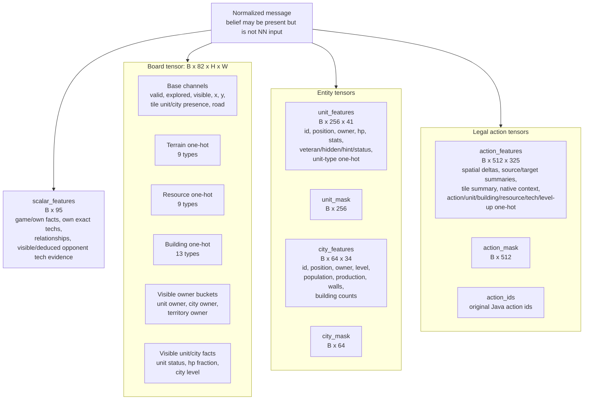
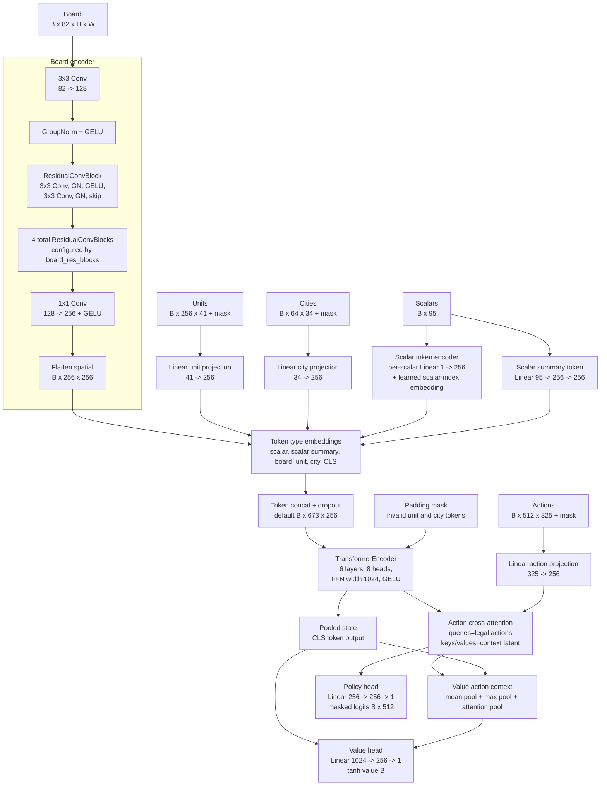
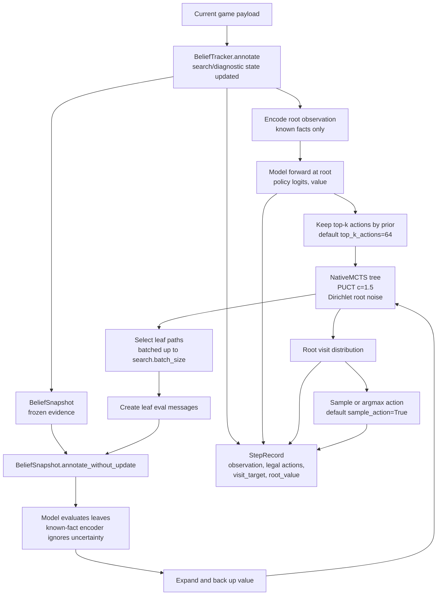

# Hybrid RL Model Architecture

This document describes the current neural model and runtime data flow implemented in `py/nn`, `py/search`, and `py/training`.

Default configuration from `ModelConfig` is derived from named schemas in `py/nn/encoding.py`:

| Item | Default |
|---|---:|
| Board input | `82 x 16 x 16` |
| Board tokens | `256` |
| Unit tokens | up to `256` |
| City tokens | up to `64` |
| Action candidates | up to `512` |
| Action feature width | `325` |
| Scalar features | `95`, represented as `95` scalar tokens plus 1 scalar summary token |
| Unit feature width | `41` |
| City feature width | `34` |
| CNN channels | `128` |
| Board residual blocks | `4` |
| Model width | `256` |
| Transformer layers | `6` |
| Attention heads | `8` |
| Explicit belief board planes in NN input | `0` |
| Coordinate-prior empty board planes | `0` |
| Trainable parameters | `7,124,610` |

## End-to-End Data Flow



The model is not used as a direct one-shot actor during self-play. `HybridRLBot.choose_action` normalizes the incoming payload, annotates it with the Python belief tracker for search/diagnostics, evaluates the root state with the network, then uses native MCTS to search over legal actions.

The current NN encoding follows a strict known-fact rule: tensors may include observed facts and deterministic facts implied by observed evidence, but not hidden authoritative state, stale projections, or probabilistic guesses. Existing replay observations may still contain `observation["belief"]`, but `encode_observation` ignores belief planes and belief opponent scalars.

## Observation Encoding



The encoder exposes every configured board channel through `BOARD_SCHEMA`; there are no empty coordinate-prior channels in the default schema. Some channels are explicitly reserved placeholders, including `reserved_hidden_authoritative`, but they are still named schema channels and are not treated as free coordinate-prior capacity. `HybridPolicyValueNet._with_empty_board_priors` remains as a compatibility hook, but `ModelConfig.use_empty_board_coordinate_priors` defaults to `False` and `POPULATED_BOARD_CHANNELS` covers every schema channel.

Board features include visible facts only:

- valid/explored/visible flags
- normalized coordinates
- terrain/resource/building one-hots
- road flag
- tile unit/city id presence
- visible unit owner buckets: own, enemy, neutral
- visible city owner buckets: own, enemy, neutral
- visible unit status and HP fraction
- visible city level
- visible territory ownership when present

Unit and city feature schemas are split. Unit rows use `UNIT_FEATURE_SCHEMA` with width `41`; city rows use `CITY_FEATURE_SCHEMA` with width `34`. The older shared `entity_feature_dim` remains in `ModelConfig` as a unit-width compatibility alias.

Action features use `ACTION_FEATURE_SCHEMA` with width `325`:

- source/target coordinates and deltas
- action intent flags
- source and target unit summaries
- source and target city summaries
- target tile summary
- native context: capture type, target-player relationship, target player id, diplomacy flags
- typed one-hots for action type, requested unit/building/resource/tech, and level-up bonus

Scalar features use `SCALAR_FEATURE_SCHEMA` with width `95`:

- game metadata and own tribe facts
- own exact researched tech flags from the player-specific observation
- monument status counts
- visible relationship summaries and diplomacy-offer flags
- known opponent tech evidence summary

Known opponent tech evidence is derived only from visible enemy units/buildings and deterministic tech prerequisites. For example, a visible enemy `KNIGHT` marks `CHIVALRY`, `FREE_SPIRIT`, and `RIDING` as known evidence. Opponent `researched_tech_ids` are not encoded unless the same tech is visible/deducible from player-specific observation evidence.

## Belief Layer

`BeliefTracker` is still a Python-only helper used by bot flow and native search. It lives per bot episode/player and resets in `HybridRLBot.reset_episode`.

Its outputs are split by use:

| Output | Current use |
|---|---|
| Visible/deduced tech evidence | Recomputed by `encode_observation` from current visible units/cities for NN scalars |
| Possible hidden capitals, stale last-seen units, hidden cloak candidates, threat projections | Kept in `observation["belief"]` for diagnostics/search plumbing, not encoded into NN tensors |

`BeliefSnapshot` is a pure search-time view. Native MCTS receives a snapshot after root annotation. Leaf payloads are annotated with `annotate_without_update`, so hypothetical search states get the same search-side context without mutating episode evidence.

## Neural Architecture



Token order in the Transformer context:

```text
[CLS] [scalar summary] [95 scalar tokens] [board tiles] [unit tokens] [city tokens]
```

Token type ids:

| Token type id | Meaning |
|---:|---|
| `0` | scalar |
| `1` | scalar summary |
| `3` | board |
| `4` | unit |
| `5` | city |
| `6` | CLS |

Token type id `2` is currently unused.

Default context token count:

```text
1 CLS + 1 scalar summary + 95 scalar + 256 board + 256 units + 64 cities = 673 tokens
```

The policy path uses action features as queries into the Transformer latent context, then applies a per-action MLP and masks invalid actions. The value path now also consumes legal-action context: it concatenates the pooled state with masked mean-pool, masked max-pool, and pooled-state attention over action tokens, producing a `4 * d_model` value input before the final tanh head.

## Action Selection with MCTS



Current native search uses the neural model as a batched evaluator. Leaf observations are re-annotated from the frozen belief snapshot before encoding, so search does not update monotonic episode evidence. Since the encoder is known-fact only, search-side uncertainty annotations do not change NN tensors.

## Training Loop

```mermaid
flowchart LR
    SelfPlay["Self-play games<br/>Java HeadlessPlay + external bots"]
    Episodes["Episode records"]
    Returns["compute_returns<br/>terminal reward discounted by gamma"]
    ReplaySample["ReplayStore.sample<br/>random records from shards"]
    Augment["Optional symmetry augmentation<br/>spatial observation/action transforms"]
    Collate["collate_batch<br/>known-fact encoded tensors<br/>policy targets + value targets"]
    Forward["Model forward"]
    Loss["Loss<br/>policy CE against visit_target<br/>+ 0.5 value MSE"]
    Step["AdamW step<br/>grad clip 1.0"]
    Save["Save latest + iteration checkpoint<br/>append metrics.csv"]

    SelfPlay --> Episodes --> Returns --> ReplaySample --> Augment --> Collate --> Forward --> Loss --> Step --> Save
```



Loss definition in the current implementation:

```text
loss = policy_loss_weight * policy_cross_entropy
     + value_loss_weight * value_mse
```

## Analysis Points / Modification Hooks

| Area | Current behavior | Why it matters |
|---|---|---|
| Known-fact encoding | NN tensors include observed facts plus deterministic implications only | Prevents hidden authoritative state and probabilistic guesses from leaking into model inputs. |
| Belief uncertainty | Kept outside NN tensors in `observation["belief"]` | Diagnostics/search plumbing can evolve without silently changing model inputs. |
| Opponent tech | Visible enemy units/buildings imply required techs and deterministic prerequisites | Gives useful factual evidence without encoding exact hidden opponent tech trees. |
| Recurrent memory | Removed from active architecture | Checkpoints from memory-based models are not shape-compatible by design. |
| Board ownership/control | Visible owner buckets encode unit/city/territory ownership | Spatial ownership is available to the CNN only when present in observation evidence. |
| Action bottleneck | Only legal actions are action-query tokens; default cap is 512 | If Java generates more than 512 legal actions, later actions are truncated and cannot be selected. |
| Entity truncation | Units cap 256, cities cap 64 | Large or unusual maps should still be checked. |
| Dense board channels | `board_channels=82`, all channels named by schema | There are no spare coordinate-prior channels in the default model. |
| Value target | Mostly terminal discounted return, shaped reward defaults to `0.0` | Sparse value signal may be slow in long games unless search/value quality is already good. |
| Masking | Unit/city masks are applied in Transformer; action mask after policy head | Invalid entities/actions are masked, board tiles are dense. |

## Source Map

| Concern | File |
|---|---|
| Model layers and tensor routing | `py/nn/model.py` |
| Explicit belief construction | `py/nn/belief.py` |
| Observation/action encoding and schemas | `py/nn/encoding.py` |
| Bot inference, replay recording | `py/nn/bot_agent.py` |
| Native MCTS wrapper | `py/search/native/mcts.py` |
| Replay records and return targets | `py/training/replay.py` |
| Training loop and losses | `py/training/train.py` |
| Symmetry augmentation | `py/nn/augmentation.py` |
| Hyperparameters | `py/search/config.py` |
