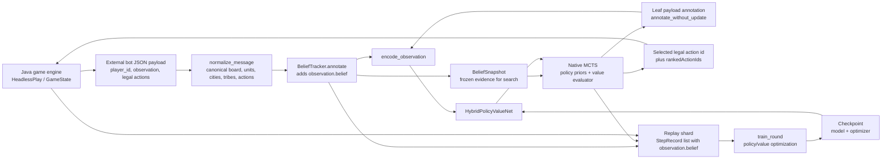
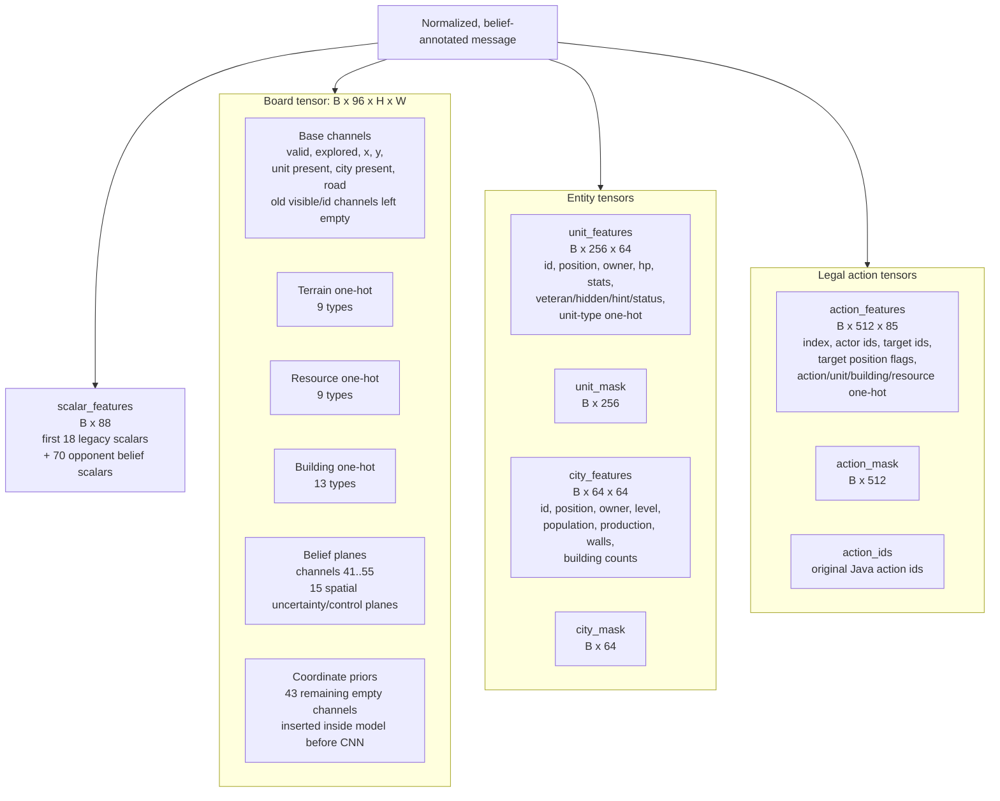
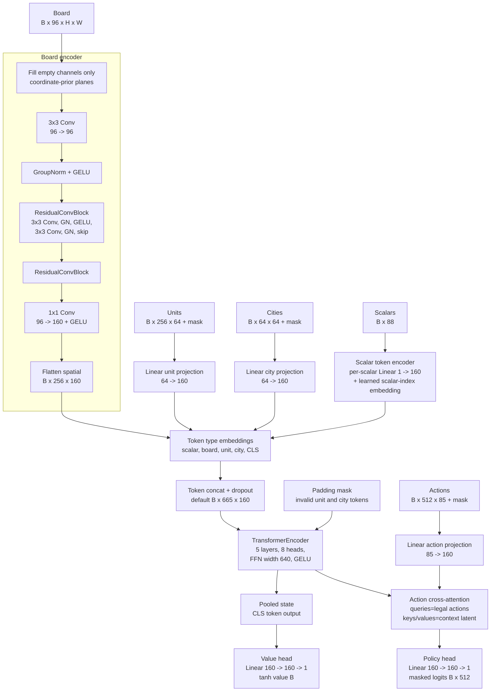
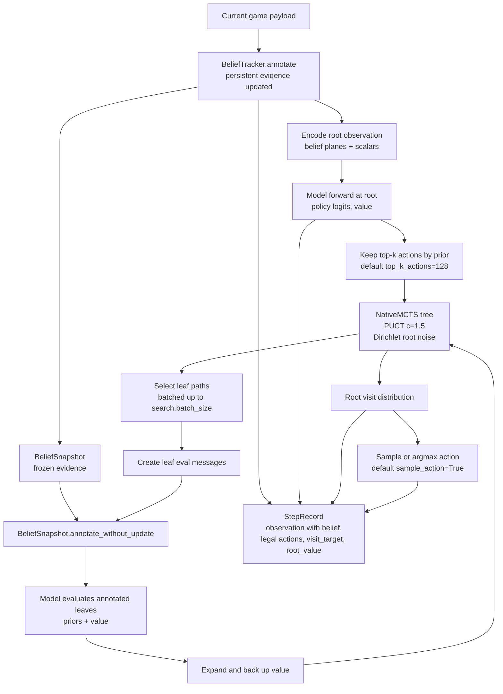

# Hybrid RL Model Architecture

This document describes the current neural model and runtime data flow implemented in `py/tribes_rl`.

Default configuration from `ModelConfig`:

| Item | Default |
|---|---:|
| Board input | `96 x 16 x 16` |
| Board tokens | `256` |
| Unit tokens | up to `256` |
| City tokens | up to `64` |
| Action candidates | up to `512` |
| Action feature width | `85` |
| Scalar features | `88`, represented as `88` scalar tokens |
| Entity feature width | `64` |
| Model width | `160` |
| Transformer layers | `5` |
| Attention heads | `8` |
| Explicit belief board planes | `15` channels |
| Coordinate-prior empty board planes | `43` channels |
| Trainable parameters | `2,210,250` |

## End-to-End Data Flow



The model is not used as a direct one-shot actor during self-play. `HybridRLBot.choose_action` normalizes the incoming payload, annotates it with explicit belief features, evaluates the root state with the network, then uses native MCTS to search over legal actions. Replay stores the annotated observation, so training consumes the same belief representation used during self-play. Older replay records without `observation["belief"]` remain valid and encode the belief inputs as zeros.

## Observation Encoding



The encoder explicitly fills 53 of the configured 96 board channels: 38 pre-existing board channels plus 15 belief channels. `HybridPolicyValueNet` fills only the remaining 43 channels with deterministic coordinate-prior planes. `POPULATED_BOARD_CHANNELS` includes channels `41..55`, so coordinate priors never overwrite belief planes.

Belief board channels:

| Channel | Plane |
|---:|---|
| `41` | `own_unit_presence` |
| `42` | `enemy_unit_presence` |
| `43` | `own_city_center` |
| `44` | `enemy_city_center` |
| `45` | `own_territory` |
| `46` | `enemy_territory` |
| `47` | `unexplored` |
| `48` | `frontier_unexplored` |
| `49` | `deep_unexplored` |
| `50` | `possible_enemy_capital` |
| `51` | `hidden_cloak_hint_source` |
| `52` | `possible_hidden_cloak` |
| `53` | `known_enemy_threat` |
| `54` | `possible_hidden_cloak_threat` |
| `55` | `known_enemy_city_zone` |

Scalar features preserve the previous first 18 values exactly. The appended 70 features are 10 scalar belief features per opponent for up to 7 opponents, ordered by ascending tribe id excluding the acting player:

```text
opponent score
my score minus opponent score
visible enemy city count
visible enemy unit count
observed enemy capital flag
inferred minimum tech count
inferred military tech flag
inferred economy tech flag
inferred naval tech flag
inferred strategy/diplomacy flag
```

## Belief Layer

`BeliefTracker` is a Python-only, conservative belief feature builder. It lives per bot episode/player and resets in `HybridRLBot.reset_episode`.

Persistent evidence is deliberately narrow:

- inferred opponent tech evidence
- observed/known opponent capital evidence

The tracker does not maintain recurrent neural memory and does not keep long-term hidden-unit position guesses. Hidden cloak/dinghy uncertainty is recomputed from current hint payloads.

`BeliefSnapshot` is a pure search-time view. Native MCTS receives a snapshot after root annotation. Leaf payloads are annotated with `annotate_without_update`, so hypothetical search states get the same belief context without mutating episode evidence.

## Neural Architecture



Token order in the Transformer context:

```text
[CLS] [88 scalar tokens] [board tiles] [unit tokens] [city tokens]
```

Token type ids:

| Token type id | Meaning |
|---:|---|
| `0` | scalar |
| `3` | board |
| `4` | unit |
| `5` | city |
| `6` | CLS |

Token type ids `1` and `2` are currently unused.

Default context token count:

```text
1 CLS + 88 scalar + 256 board + 256 units + 64 cities = 665 tokens
```

## Action Selection with MCTS



Current native search uses the neural model as a batched evaluator. Leaf observations are re-annotated from the frozen belief snapshot before encoding, so search does not update monotonic episode evidence. The C++ transition support determines how much of the state advances for each action; unsupported transitions become terminal leaf payloads.

## Training Loop

```mermaid
flowchart LR
    SelfPlay["Self-play games<br/>Java HeadlessPlay + external bots"]
    Episodes["Episode records<br/>observations include belief"]
    Returns["compute_returns<br/>terminal reward discounted by gamma"]
    ReplaySample["ReplayStore.sample<br/>random records from shards"]
    Augment["Optional symmetry augmentation<br/>belief planes transform spatially<br/>opponent scalars unchanged"]
    Collate["collate_batch<br/>encoded tensors<br/>policy targets + value targets"]
    Forward["Model forward"]
    Loss["Loss<br/>policy CE against visit_target<br/>+ 0.5 value MSE"]
    Step["AdamW step<br/>grad clip 1.0"]
    Save["Save latest + iteration checkpoint<br/>append metrics.csv"]

    SelfPlay --> Episodes --> Returns --> ReplaySample --> Augment --> Collate --> Forward --> Loss --> Step --> Save
```



Loss definition in the current implementation:

```text
loss = policy_loss_weight * policy_cross_entropy
     + value_loss_weight * value_mse
```

## Analysis Points / Modification Hooks

| Area | Current behavior | Why it matters |
|---|---|---|
| Explicit belief | Python builder writes `observation["belief"]` | Representation captures uncertainty without Java protocol changes. |
| Recurrent memory | Removed from active architecture | Checkpoints from memory-based models are not shape-compatible by design. |
| Board ownership/control | Dense belief planes encode own/enemy units, city centers, territory, city zones | Spatial ownership is now available to the CNN instead of only entity tokens. |
| Hidden units | Current cloak hints produce local candidate/threat planes | No long-term last-seen normal-unit tracking is implemented. |
| Opponent economy/tech | 70 scalar belief features appended after legacy scalars | Evidence is monotonic per episode and ordered by tribe id. |
| Search semantics | Leaf payloads are annotated without mutating tracker state | Avoids search hallucinations changing real episode evidence. |
| Action bottleneck | Only legal actions are action-query tokens; default cap is 512 | If Java generates more than 512 legal actions, later actions are truncated and cannot be selected. |
| Entity truncation | Units cap 256, cities cap 64 | Large or unusual maps should still be checked. |
| Dense board channels | `board_channels=96`, with 43 coordinate-prior empty channels | Spare channels are useful spatial priors and do not overwrite populated or belief channels. |
| Value target | Mostly terminal discounted return, shaped reward defaults to `0.0` | Sparse value signal may be slow in long games unless search/value quality is already good. |
| Masking | Unit/city masks are applied in Transformer; action mask after policy head | Invalid entities/actions are masked, board tiles are dense. |

## Source Map

| Concern | File |
|---|---|
| Model layers and tensor routing | `py/tribes_rl/model.py` |
| Explicit belief construction | `py/tribes_rl/belief.py` |
| Observation/action encoding | `py/tribes_rl/encoding.py` |
| Bot inference, replay recording | `py/tribes_rl/bot_agent.py` |
| Native MCTS wrapper | `py/tribes_rl/native/mcts.py` |
| Replay records and return targets | `py/tribes_rl/replay.py` |
| Training loop and losses | `py/tribes_rl/train.py` |
| Symmetry augmentation | `py/tribes_rl/augmentation.py` |
| Hyperparameters | `py/tribes_rl/config.py` |
